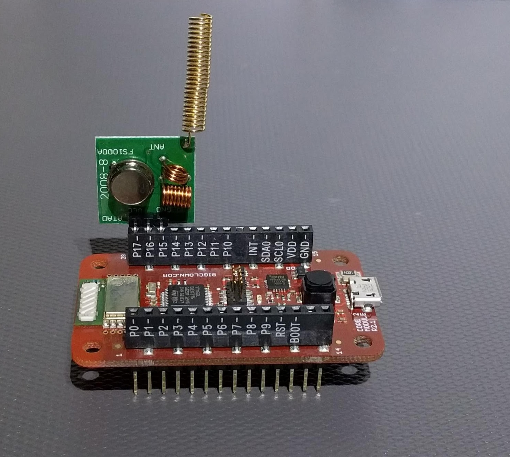

# Somfy controller

Rewritten [Arduino Sketch](https://github.com/Nickduino/Somfy_Remote) to BigClown Core Module.



## Control via MQTT

**Topic:** `node/{node id}/somfy/s{shutter number}/cmd/{command}`

* node id - ID or alias for radio node
* shutter number - number for roller shutter, from 1 to 5
* command - up, stop, down, prog

**Value:** rolling code, you can start from number 1, every next number must be larger than the previous

Example:
```
mosquitto_pub -t 'node/test/somfy/s3/cmd/prog' -m 1
mosquitto_pub -t 'node/test/somfy/s3/cmd/down' -m 2
mosquitto_pub -t 'node/test/somfy/s3/cmd/stop' -m 3
mosquitto_pub -t 'node/test/somfy/s3/cmd/up' -m 4
```

## Register new device to motor

* Long-press the program button of your existing remote control until your blind goes up and down slightly
* Send `prog` command
* Blind goes up and down as confirmation
